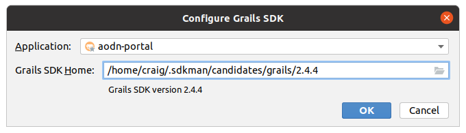

AODN Open Geospatial Portal
===========================

[](https://travis-ci.org/aodn/aodn-portal)

The AODN open geospatial portal is a [Grails](http://grails.org/) application for discovering, subsetting, and downloading geospatial data.

The application is a stateless front end to other servers: 

* [GeoNetwork](http://geonetwork-opensource.org/) metadata catalog
* [GeoServer](http://geoserver.org/) data server (WMS and WFS and our WPS subsetting and aggregation services
* [THREDDS](http://thredds.aodn.org.au/thredds/) Gridded (ncWMS files) data server with embedded ncWMS (http://www.resc.rdg.ac.uk/trac/ncWMS/) web map server

You can view the portal in action at [AODN Portal](https://portal.aodn.org.au), which always runs the latest version of the code.

## Contact
info@aodn.org.au or see https://help.aodn.org.au/ .

## Features
* Easy 1-2-3 workflow (1.Search, 2.Subset, 3.Download)
* Faceted search for easy discovery of data collections
* Visualise subsetting results before download via WMS
* Download data from a variety of web services (eg. WFS)
* Configurable themes and splash page

## Getting Your Hands on Portal
* [Building From Source](#building-from-source)
* [Can I Get A Pre-Built War?](#can-i-get-a-pre-built-war)
* [Installation](#installation)

## [Building From Source](#building-from-source)
If you want to build from source you will need to have [Grails](http://grails.org/) 2.4.4 and JDK 1.8 installed on your build machine. The JDK needs to be Oracle, version 1.8.0_31 to use run-app.

The recommended way of installing grails is by using [SdkMan](http://sdkman.io/):
```
$ curl -s http://get.sdkman.io | bash 
$ source $HOME/.sdkman/bin/sdkman-init.sh
$ sdk install grails 2.4.4
$ sdk use grails 2.4.4
```
Once you have the source it should be as simple as ```$ grails war``` in the root folder where you have checked out portal
then deploy the war to your application server.

## Can I Get A Pre-Built War?
Yes, you can download it from our [public binaries repo](http://binary.aodn.org.au/?prefix=jobs/portal_4_prod/).

## Installation
The AODN Portal has been tested with Tomcat.  All you need to do is deploy the WAR and add a configuration file that tells the portal:
* Where to find GeoNetwork
* Your CSS for branding and styling
* Trusted servers

Define the location of the configuration file by setting an environment context variable named ```aodn.configuration```

One way to do this is by adding a file called &lt;context&gt;.xml in the ```$CATALINA_BASE/conf/[enginename]/[hostname]/``` directory. Where &lt;context&gt; matches the context of the deployed WAR (eg. "aodn-portal-3.42.1-production.xml").  Set the variable by adding the following line to the file: 
```<Environment name="aodn.configuration" value="<path to file>/Portal.groovy" type="java.lang.String" override="true"/>```

Then add the file called ```Portal.groovy```

You can clone an example [here](https://github.com/aodn/aodn-portal/blob/master/grails-app/conf/Config.groovy) and modify as required. 

## Development with IntelliJ

Although other versions may work the following assumes you have:

* Ubuntu 20.04.3 LTS or 18.04.6 LTS
* Latest IntelliJ IDEA Ultimate (2021.3.2 was used at time of writing)
* Java OpenJDK 1.8

Requirements:

* Grails 2.4.4 (see [Building From Source](#building-from-source))

Configure IntelliJ:

Access Tools --> Grails --> Configure Grails SDK and set the project name and location to the Grails 2.4.4 SDK.



Make sure the correct JDK (Java OpenJDK 1.8) is selected in the Project Structure.

Debugging:

The project includes a run configuration suitable for debugging ([Grails_aodn-portal.run.xml](.run/Grails_aodn-portal.run.xml)). 
Select this from the run configurations list and click the debug button. This will run the application using the development
configuration found in [Config.groovy](grails-app/conf/Config.groovy). A JDWP transport mechanism is accessible via
dt_socket. 

Go to the IntelliJ debug panel and click on the Console tab. This will show the command line used to run the application
along with the address to which a debugger can be attached. To use the IntelliJ debugger, click the "Attach debugger" link.

After a brief pause the Portal UI will run in your default browser at http://localhost:8080. Two processes will be listed
in the IntelliJ "Stop Process" menu. Now you can set breakpoints and use other IntelliJ debug functions.

The provided run configuration also includes Java JVM options which enable monitoring via JConsole on port 8008.

## Getting Started (How Do I Drive This Thing?)
Read the [Getting Started guide](https://github.com/aodn/aodn-portal/wiki/Getting-Started) on the wiki

## Contributing
We welcome contributions so please feel free to fork the project, address any issues or add features and submit
a pull request.


